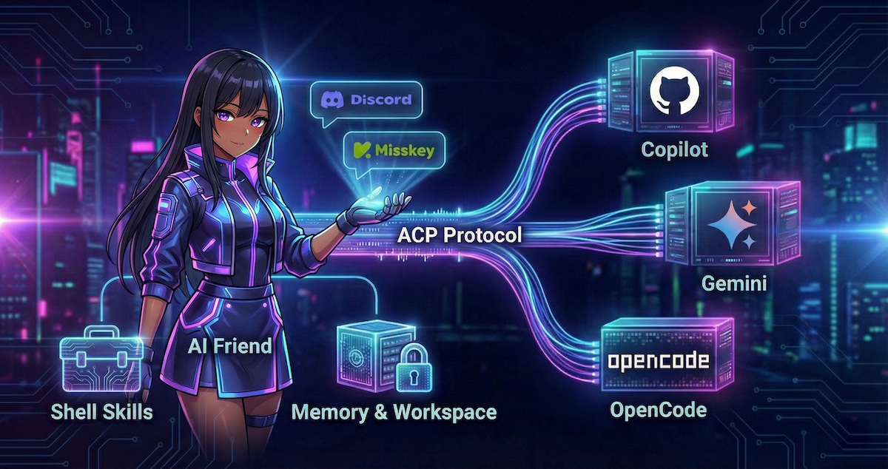

# AIr-Friends



[](https://codecov.io/gh/jim60105/AIr-Friends) [](https://github.com/jim60105/AIr-Friends/actions) [](https://github.com/jim60105/AIr-Friends/releases) [](LICENSE) [](https://github.com/jim60105/AIr-Friends/pkgs/container/air-friends)

Your AIr friends custom chatbot with integrated shell and skills. Powered by ACP AI agents, it remembers conversations across channels while keeping your data organized in isolated workspaces.

## ✨ Highlights

- 🤖 **Multi-Platform**: Currently works on Discord and Misskey
- 🧠 **Persistent Memory**: Remembers conversations across different channels
- 🗜️ **Memory Maintenance**: Optional scheduled agent task to summarize and compact old memories
- 📝 **Agent Knowledge Base**: Personal workspace for long-term knowledge notes and reflections
- 🔒 **Privacy First**: Isolated workspaces per user with access control
- 🐳 **Easy Deploy**: One-command container deployment
- 🎨 **Customizable**: Template-based personality prompt system
- 🔌 **Extensible**: Skill-based architecture

## 🚀 Quick Start

The recommended way to run AIr-Friends is by using containers:

1. **Prepare .env file**

   ```bash
   # Download example file
   wget https://raw.githubusercontent.com/jim60105/AIr-Friends/master/.env.example -O .env

   # Edit with your credentials
   vim .env
   ```

2. **Run with Podman (or Docker)**

   ```bash
   podman run -d --rm \
     -v data:/app/data \
     --env-file .env \
     --name air-friends \
     ghcr.io/jim60105/air-friends:latest
   ```

3. **Or use Compose**

   ```bash
   wget https://raw.githubusercontent.com/jim60105/AIr-Friends/master/compose.yml
   podman compose up -d
   ```

That's it! Your bot should now be online.

## 🎨 Customizing Your Bot

Want to change the personality of your bot? Edit the prompt files:

```bash
# Clone or download the entire prompts directory from the repository.
# https://github.com/jim60105/AIr-Friends/tree/master/prompts

# Edit character files
vim prompts/character_info.md
vim prompts/character_name.md
vim prompts/character_personality.md
vim prompts/character_reference_terms.md
vim prompts/character_speaking_style.md

# These two files are also required for the system to function when customizing prompts.
cat prompts/system.md
cat prompts/system_prompt_override.md

# Mount when running
podman run -d --rm \
  -v data:/app/data \
  -v ./prompts:/app/prompts:ro \
  --env-file .env \
  --name air-friends \
  ghcr.io/jim60105/air-friends:latest
```

See [Development Guide -- Customizing the Bot](docs/DEVELOPMENT.md#customizing-the-bot) section for details.

## 🔐 Access Control

Control who can interact with your bot using the whitelist feature:

```yaml
accessControl:
  replyTo: "whitelist" # Options: all, public, whitelist
  whitelist:
    - "discord/account/123456789012345678"
    - "misskey/account/abcdef1234567890"
```

See [Development Guide -- Access Control & Reply Policy](docs/DEVELOPMENT.md#access-control--reply-policy) section for details.

## 🛡️ Rate Limiting

Prevent excessive API usage per user with configurable rate limiting:

```yaml
rateLimit:
  enabled: false
  maxRequestsPerWindow: 10
  windowMs: 600000    # 10-minute sliding window
  cooldownMs: 600000  # Cooldown after limit exceeded
```

## 🏗️ Architecture

AIr-Friends acts as an [ACP (Agent Client Protocol)](https://agentclientprotocol.com/) client, delegating AI reasoning to external agents while maintaining persistent memory:

```text
┌─────────────────────────────────────────┐
│  Platform (Discord/Misskey)             │
│            ↓                            │
│  AIr-Friends (ACP Client)               │
│            ↓                            │
│  External AI Agent                      │
│  (Copilot/Gemini/OpenCode)              │
│            ↓                            │
│  Skills & Memory System                 │
└─────────────────────────────────────────┘
```

See [Design Document](docs/DESIGN.md) for detailed architecture.

## 📦 Container Details

The official container image includes:

- Pre-installed AI agent binaries (Copilot CLI, Gemini CLI, OpenCode CLI)
- Auto-approval mode enabled for isolated execution
- Health check endpoint on port 8080
- Default prompts at `/app/prompts` (can be overridden)

## 🛠️ Development

See [Development Guide](docs/DEVELOPMENT.md) for complete setup instructions.

## License


[GNU GENERAL PUBLIC LICENSE Version 3](LICENSE)

Copyright (C) 2026 Jim Chen <Jim@ChenJ.im>.

This program is free software: you can redistribute it and/or modify it under the terms of the GNU General Public License as published by the Free Software Foundation, either version 3 of the License, or (at your option) any later version.

This program is distributed in the hope that it will be useful, but WITHOUT ANY WARRANTY; without even the implied warranty of MERCHANTABILITY or FITNESS FOR A PARTICULAR PURPOSE. See the GNU General Public License for more details.

You should have received a copy of the GNU General Public License along with this program. If not, see [https://www.gnu.org/licenses/](https://www.gnu.org/licenses/).
